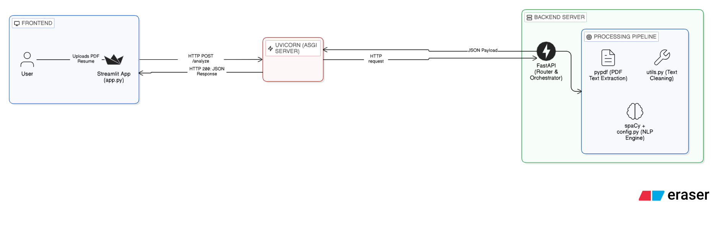

<div align="center">

# 🧠 Vitae-I

**Intelligent Curriculum Analyser**

[](https://www.python.org/)
[](https://fastapi.tiangolo.com/)
[](https://streamlit.io/)
[](https://spacy.io/)
[](./LICENSE)

Upload a PDF resume and get an instant AI-powered breakdown of the candidate's skills, identity, and key background — no manual reading required.

</div>

---

## 📌 The Problem

Recruiters and hiring managers spend an enormous amount of time simply *reading* resumes to find the same handful of data points: what are this person's technical skills? Where did they study? What companies have they worked for?

**Vitae-I automates this.** You upload a PDF resume and the system delivers a structured summary in seconds — candidate name, technical skill tags, organizations, and locations — powered by NLP that actually understands Portuguese.

The project was built with the Brazilian job market in mind, where most resumes are written in PT-BR and reference institutions (federal universities, IFs, etc.) that generic English-first models fail to recognize.

---

## 📸 Demo

> **Upload a Resume → Get Structured Intelligence**

```
1. Open the Streamlit dashboard at http://localhost:8501
2. Upload any PDF resume
3. Click "Analyze Resume"
```

**API Example (direct call):**
```bash
curl -X POST "http://localhost:8000/analyze" \
     -H "accept: application/json" \
     -F "file=@resume.pdf"
```

**API Response:**
```json
{
  "text_preview": "Leonardo Ruhmann. Desenvolvedor Full Stack...",
  "skills": ["Python", "React", "FastAPI", "Docker", "PostgreSQL"],
  "people": ["Leonardo Ruhmann"],
  "info": ["Universidade de Brasília", "Rio de Janeiro"]
}
```

---

## 🛠️ Tech Stack

| Layer       | Technology                                   |
|-------------|----------------------------------------------|
| Frontend    | [Streamlit](https://streamlit.io/)           |
| Backend API | [FastAPI](https://fastapi.tiangolo.com/) + [Uvicorn](https://www.uvicorn.org/) |
| NLP Engine  | [spaCy](https://spacy.io/) `pt_core_news_lg` |
| PDF Parsing | [pypdf](https://pypdf.readthedocs.io/)       |
| Language    | Python 3.10+                                 |

---

## ✅ Prerequisites

- Python **3.10 or higher**
- `pip` and `venv`
- ~600 MB free disk space (for the spaCy Portuguese NLP model)

---

## 🚀 Installation

```bash
# 1. Clone the repository
git clone https://github.com/your-username/vitae-i.git
cd vitae-i

# 2. Create and activate a virtual environment
python3 -m venv venv
source venv/bin/activate

# 3. Install all dependencies
pip install -r requirements.txt
```

> The `requirements.txt` includes the `pt_core_news_lg` spaCy model directly from its GitHub release URL, so no separate `spacy download` command is needed.

---

## ▶️ How to Run

A `run.sh` script is provided to make startup straightforward.

### Run everything (API + Frontend)

```bash
chmod +x run.sh
./run.sh
```

This will start:
- The **API** at `http://localhost:8000`
- The **Frontend** at `http://localhost:8501`

### Run individually

```bash
# API only
./run.sh api

# Frontend only
./run.sh app

# Run tests
./run.sh test
```

### Environment Variables

No `.env` file is required to run the project in its current state. All configuration lives in `config.py`. If you need to change the API URL the Streamlit app targets, update this line in `app.py`:

```python
API_URL = "http://127.0.0.1:8000/analyze"
```

### Running tests

```bash
# With the venv activated:
pytest tests/
```

---

## 🏗️ Architecture


The frontend and backend are **fully decoupled**. The Streamlit app is just an HTTP client — the API can be used independently by any other consumer (a CLI tool, another web app, etc.).

The NLP pipeline uses a **hybrid approach**:
1. **Rule-based Entity Ruler** runs *before* the neural NER, injecting high-confidence entities from the curated `config.py` dictionaries (skills, orgs, locations).
2. **Neural NER** (`pt_core_news_lg`) handles generic entity types that aren't in the dictionaries — most importantly, the candidate's name (`PER`).
3. A **post-processing filter** (`is_valid_entity` in `utils.py`) discards noise using a blacklist and heuristics, preventing section headers, degrees, and job titles from being misclassified as entities.

---

## 💡 Technical Decisions

### Why spaCy and not a transformer (BERT/GPT)?
Speed and practicality. Resume analysis needs to be snappy and run local without a GPU. `pt_core_news_lg` is a well-trained Portuguese model that gives solid NER performance for person/org/location detection, and by layering the `entity_ruler` on top of it, the accuracy on skill extraction becomes near-perfect without any fine-tuning cost.

### Why a hybrid rule-based + neural approach?
Skills like "React" or "FastAPI" are proper nouns but not famous enough for a general-purpose NER model to learn. A pure neural approach would miss most tech skills. Pure rule-based would miss candidate names. The hybrid approach gets the best of both worlds.

### Why FastAPI instead of serving directly from Streamlit?
Separation of concerns. The API can be consumed independently, tested in isolation, versioned, and swapped for a different frontend without any backend changes. It also enables future scaling (e.g., putting the API behind a queue if processing becomes heavy).

### What I'd do differently
- Add an async job queue (Celery or ARQ) for handling many simultaneous uploads without blocking.
- Add a fine-tuned training set for Brazilian tech skills and company names to reduce reliance on the `config.py` dictionaries.
- Replace the `INVALID_WORDS` blacklist with a proper classifier to filter noise — the blacklist is brittle and requires maintenance.

---

## 📊 Project Status

> 🟡 **Active Development** — The project is functional and used for portfolio demonstration. Core features are stable; new entity categories and a more robust filtering system are planned.

---

## 📄 License

[MIT](./LICENSE) — free to use, fork, and adapt.
